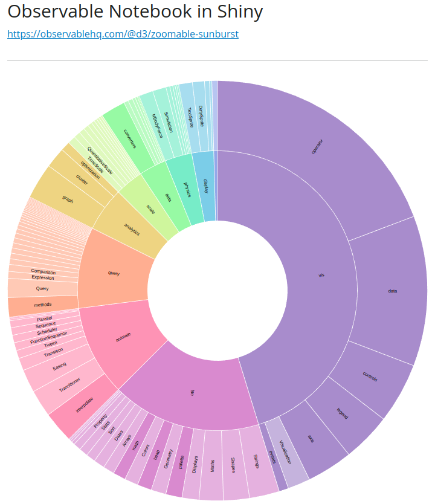

# shinyobservable

Embed [Observable Notebooks](https://observablehq.com/) in [Shiny for Python](https://shiny.posit.co/py/).

Shinyobservable makes it a breeze to integrate libraries such as [D3](https://d3js.org/).

Create any kind of JavaScript visualizations and let Shiny handle your data and interactivity. 

## Features

* Embed entire notebooks
* Embed selected cells only
* Update data cells to update visualizations

## Installation

```bash
pip install shinyobservable

# Dev
pip install git+https://github.com/eodaGmbH/py-shiny-shinyobservable
```

## Quickstart

```python
from htmltools import a
from shiny.express import ui
from shinyobservable import Observable, ObservableRenderer

NOTEBOOK = "https://observablehq.com/@d3/zoomable-sunburst"

ui.h1("Observable Notebook in Shiny")
ui.div(a(NOTEBOOK, href=NOTEBOOK, target="_blank"))
ui.hr()

# Render entire notebook
@ObservableRenderer
def render_notebook():
    return Observable(NOTEBOOK)


# Render single cells only
@ObservableRenderer
def render_cells():
    return Observable(NOTEBOOK, cells=["chart"])
```

Enjoy your Observable Notebook in Shiny!



See [this example](docs/examples/getting_started/redefine_data.py) on how to update the data of your notebook.

## Docs

https://eodagmbh.github.io/py-shiny-observable/
